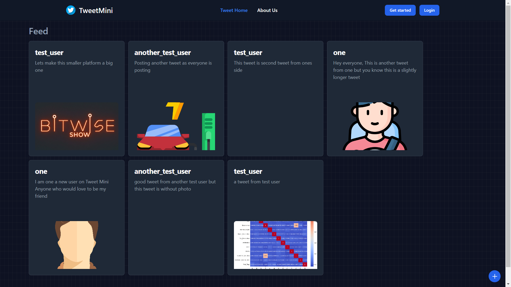
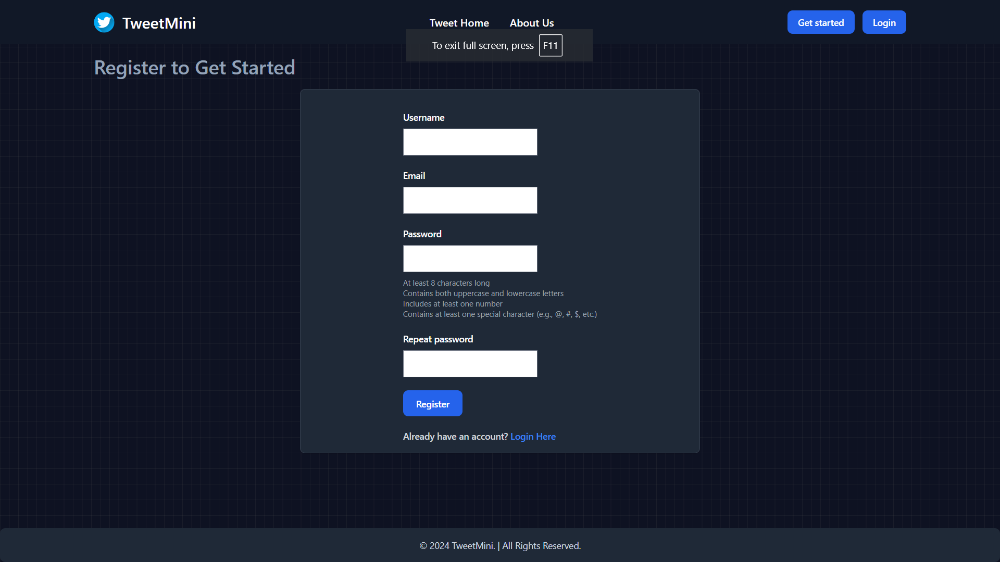
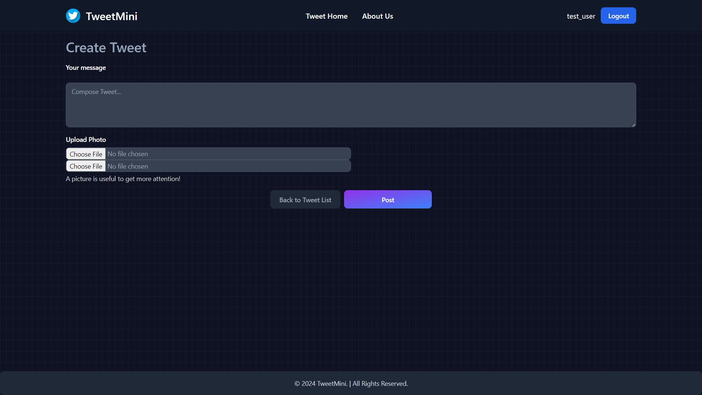

# TweetMini

TweetMini is a basic Django-based application that allows users to authenticate, create tweets, edit tweets, and delete tweets. This mini-project serves as a simple example of how to build a basic CRUD (Create, Read, Update, Delete) application with Django.

## Tech Stack
Django

## Features

- User Authentication: Users can register, log in, and log out.
- Create Tweet: Authenticated users can create new tweets.
- Edit Tweet: Authenticated users can edit their existing - tweets.
- Delete Tweet: Authenticated users can delete their tweets.

## Screenshots





## Prerequisites

- Python 3.x
- Django 3.x or higher
- Virtualenv (optional but recommended)

## Installation
To install this project in your local machine run this command

1. Clone the repository:
   ```bash
   git clone https://github.com/Advanced-Boy-Shreyash/Django-TweetMini.git
   ```
2. Create and activate a virtual environment (optional but recommended):
   ```bash
   python -m venv .venv
   .venv\Scripts\activate # On Mac run 'source venv/bin/activate'
   ```
3. Install dependencies:
   ```bash
   pip install -r requirements.txt
   ```
4. Apply migrations:
   ```bash
   python manage.py migrate
   ```
5. Create a superuser (to access the admin site):
   ```bash
   python manage.py createsuperuser
   ```
6. Run the development server:
Two terminals required:

   In first terminal run:
   ```bash
   python manage.py runserver
   ```
   Another terminal run:
   ```bash
   python manage.py tailwind start
   ```

## Run Locally
Open your browser and navigate to http://127.0.0.1:8000/.

## Usage/Examples

User Authentication
- Register: Navigate to /register/ to create a new account.
- Login: Navigate to /login/ to log in to your account.
- Logout: Navigate to /logout/ to log out of your account.

Tweet Operations
- Create Tweet: Once logged in, navigate to /tweets/new/ - to create a new tweet.
- Edit Tweet: Navigate to /tweets/<tweet_id>/edit/ to edit an existing tweet. Only the owner of the tweet can edit it.
- Delete Tweet: Navigate to /tweets/<tweet_id>/delete/ to delete an existing tweet. Only the owner of the tweet can delete it.